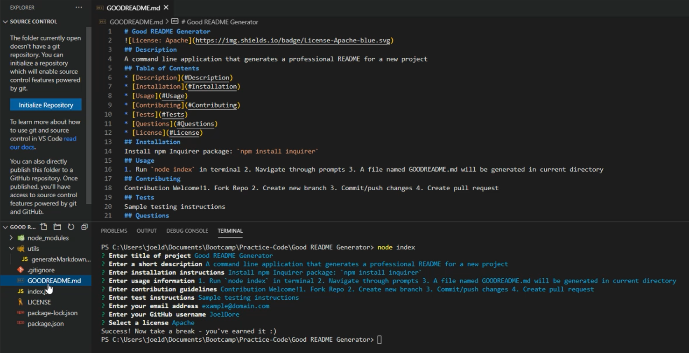

# README-generator

  
  

## _Command line application that generates a professional README for a new project_
 

## Table of Contents  

* [Installation](#Installation)  
* [Usage](#Usage)  
* [Contributing](#Contributing)   
* [Questions](#Questions)
* [License](#License)

## Installation  

Requires the npm Inquirer package:  `npm install inquirer`

## Usage  

--> **[Walkthrough Video](https://drive.google.com/file/d/1R_s9pzMI0V9uTZcgaLbxm0oQcRRY6-sk/view?usp=sharing)** <--

1. Run `node index` in terminal  
2. Navigate through prompts  
3. A file named `GOODREADME.md` will be generated in current directory  

## Contributing  

Contributions welcome!
1. Fork this repository  
2. Create a new branch  
3. Commit/push your changes  
4. Create a new pull request  

## Questions  
Feel free to send me an email at dore.joel.dore@gmail.com!  

## License
This project is [MIT](https://github.com/JoelDore/README-generator/blob/main/LICENSE) licensed.  
© 2020 [Joel Dore](https://github.com/JoelDore)  

---
 

 
 

